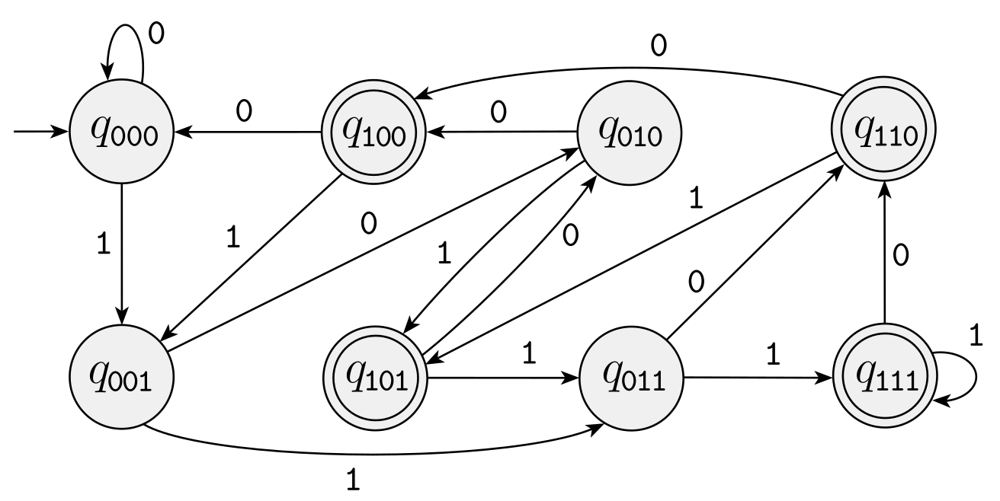
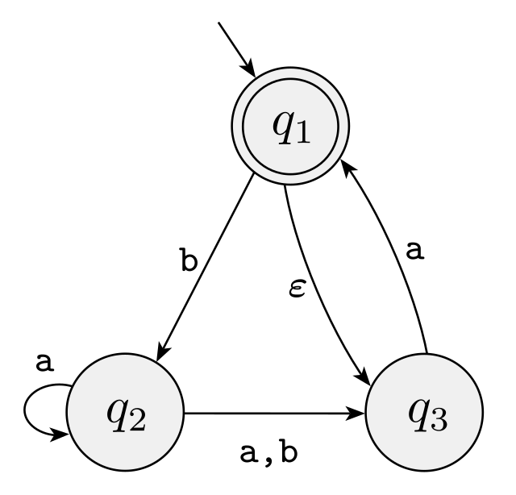
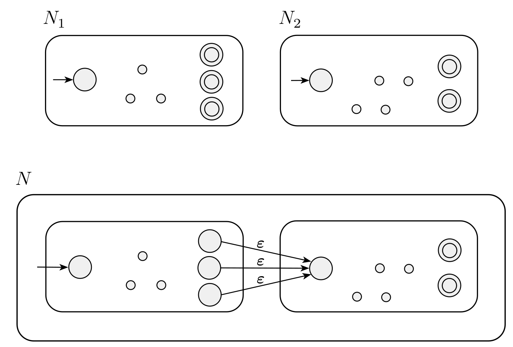
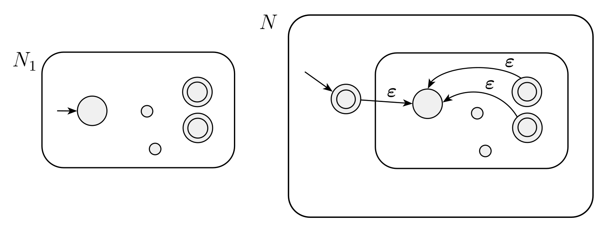
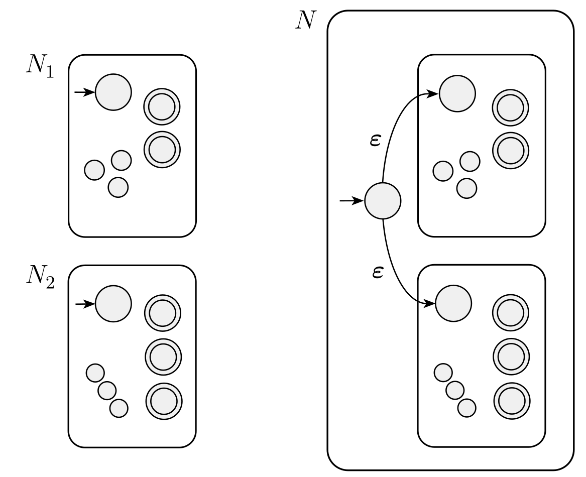

# Nondeterminism

## DFA vs NFA

- DFA: **Deterministic** Finite Automaton (what we have been doing)
- NFA: **Non-Deterministic** Finite Automaton (new)

In an NFA, we can have multiple arrows for the same symbol, or no arrows for some symbols, or an arrow lableled with $\varepsilon$.


- Each arrow spawns a new machine in the new state.
- $\varepsilon$ spawns a new machine in the new state without consuming an input character.
- Similar to Multithreading
- If any machine ends in an accept state, the NFA accepts.

## Example NFA

```{r, echo=FALSE, fig.width=8, fig.height=3.5, message=FALSE, fig.align='center'}
library(igraph)
a4 <- graph_from_literal(" "-+q1-+q2-+q3-+q4-+q4, q1-+q1, simplify=FALSE)
coords <- layout_on_grid(a4, width = 5)
plot(a4, 
     edge.curved = c(0, 0, 0, 0, 0.5, 0.5), 
     layout=coords,
     vertex.size = 15,
     vertex.shape = c("none", "circle", "circle", "circle", "circle"),
     vertex.label = c(" ", expression(italic(q)[1]), expression(italic(q)[2]), expression(italic(q)[3]), expression(italic(q)[4])),
     edge.loop.angle=3.14*1.5,
     mark.groups = list(5), mark.shape = 0.75, mark.col = "pink", mark.border = "black",
     vertex.label.cex = 1,
     edge.label = c("","     1\n", expression(atop("   0," ~ epsilon,  " ")), "  1\n","0,1\n","0,1\n"), 
     edge.label.cex = 1,
     edge.width = 2,
     ylim = c(-1.02,-0.65), xlim=c(-0.1,0.5))
```

<div class="notes">
Copy to board <br>
Illustrate Accepting 010110, 101, Not accepting 100. Magnets? Tree?
Accepts anything with 101 or 11 in it? 
</div>

## NFA "guessing"

$A = \{w \mid w \text{ has a 1 in the third position from end}\}$

How do you know when you are at the third position from the end?

```{r, echo=FALSE, fig.width=7, fig.height=3.2, message=FALSE, fig.align='center'}
library(igraph)
a4 <- graph_from_literal(" "-+q1-+q2-+q3-+q4, q1-+q1, simplify=FALSE)
coords <- layout_on_grid(a4, width = 5)
plot(a4, 
     edge.curved = c(0, 0, 0, 0, 0.5), 
     layout=coords,
     vertex.size = 15,
     vertex.shape = c("none", "circle", "circle", "circle", "circle"),
     vertex.label = c(" ", expression(italic(q)[1]), expression(italic(q)[2]), expression(italic(q)[3]), expression(italic(q)[4])),
     edge.loop.angle=3.14*1.5,
     mark.groups = list(5), mark.shape = 0.75, mark.col = "pink", mark.border = "black",
     vertex.label.cex = 1,
     edge.label = c("","     1\n", "   0,1\n", "   0,1\n", "0,1\n"), 
     edge.label.cex = 1,
     edge.width = 2,
     ylim = c(-1.05,-0.65), xlim=c(0,0.5))
```

<div class="notes">
Copy to board <br>
</div>

## DFA version

$A = \{w \mid w \text{ has a 1 in the third position from end}\}$

```{r, echo=FALSE, fig.align='center', out.width="70%"}
library(knitr)

```

<div class="notes">
Note that it needs 8 states to store all the possible final three digits.
</div>

## Another NFA example

```{r, echo=FALSE, fig.align='center', out.width="40%"}
library(knitr)

```

<div class="notes">
Accepts e, a, baba, baa. Not b, bb, babba.
</div>

# Closure under concatenation and star (and union)

## Closure constructions

If we have NFA's $N_1$ and $N_2$ that recognize languages $A_1$ and $A_2$, can we construct

- an NFA that recognizes $A_1 \circ A_2$?
- an NFA that recognizes $A_1^*$?

## Closure under concatenation

```{r, echo=FALSE, fig.align='center', out.width="70%"}
library(knitr)

```

## Closure under star

```{r, echo=FALSE, fig.align='center'}
library(knitr)

```


## Closure under union (using NFA's this time)

```{r, echo=FALSE, fig.align='center', out.width="55%"}
library(knitr)

```


# What languages do NFA's recognize?

## Closure constructions

We have proved that if we have NFA's $N_1$ and $N_2$ that recognize languages $A_1$ and $A_2$, can we construct

- an NFA that recognizes $A_1 \circ A_2$
- an NFA that recognizes $A_1^*$
- an NFA that recognizes $A_1 \cup A_2$.

So the set of languages that can be recognized by an NFA is closed under the regular operations.

## A DFA is an NFA

## Is an NFA a DFA?

## Formal Definition of a DFA

A **finite automaton** (DFA) is a 5-tuple $(Q, \Sigma, \delta, q_0, F)$, where

1. $Q$ is a finite set called the **states**,
2. $\Sigma$ is a finite set called the **alphabet**,
3. $\delta: Q \times \Sigma \longrightarrow Q$ is the **transition function**,
4. $q_0 \in Q$ is the **start state**, and
5. $F \subseteq Q$ is the set of **accept states**.

What modifications would we need to make to define an NFA?
