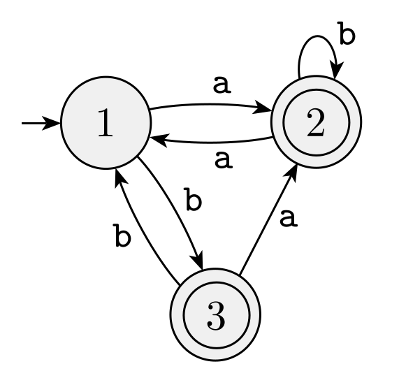
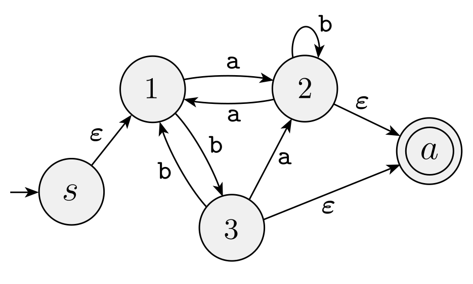
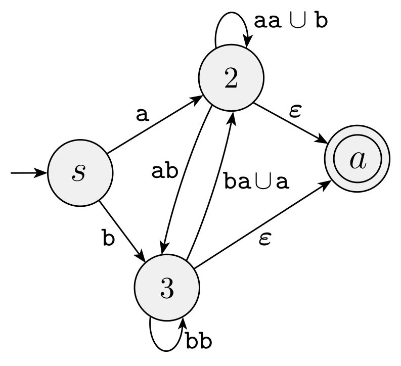
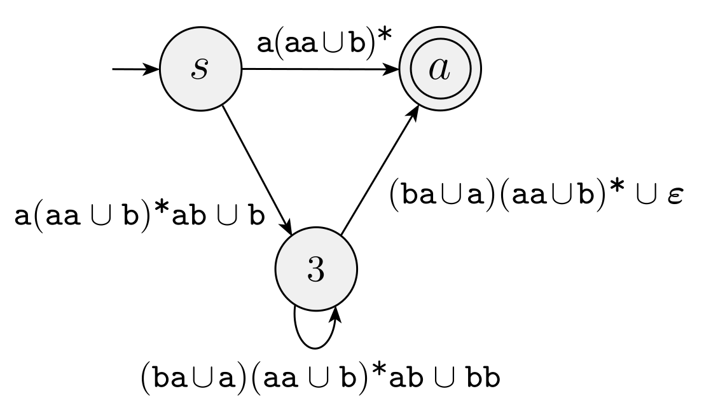
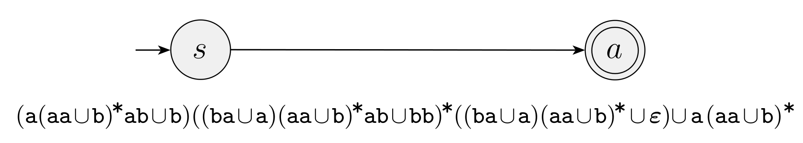

```{r include=FALSE}
set.seed(11520)
fnames <- sample(c("Sam", "James", "Drake", "Wesley", "Sophia", "Carolyn", "Trevor", "Tristan", "Ryley"))
```

# Prework Presentations

## 2. [`r paste(fnames[1:3], sep = ',')`] 

Consider the language described by the regular expression $a(abb)^*\cup b$. Use the construction of the proof of Lemma 1.55 to build an NFA that recognizes this language.

## 3. [`r paste(fnames[4:6], sep = ',')`] 

Consider the language described by the regular expression $(0\cup 1)^*000(0\cup 1)^*$. Use the construction of the proof of Lemma 1.55 to build an NFA that recognizes this language.

## 5. [`r paste(fnames[7:9], sep = ',')`] 

Modify the GNFA in Problem 4 to create a new GNFA with only four states that recognizes the same language. Do this by deleting state $q_5$ and modifying the label on the arrow from states $q_2$ to $q_3$. 

```{r, echo=FALSE, fig.width=5, fig.height=4, message=FALSE, fig.align='center', warning=FALSE}
library(igraph)
a3 <- graph_from_literal(" "-+q1-+q2-+q3-+q4, q2-+q5-+q3, simplify=FALSE)
set.seed(123)
coords <- layout_nicely(a3)
plot(a3, 
     edge.curved = 0, 
     layout=coords,
     vertex.size = 25,
     vertex.shape = c("none", "circle", "circle", "circle", "circle", "circle"),
     vertex.label = c(" ", expression(italic(q)[1]), expression(italic(q)[2]), expression(italic(q)[3]), expression(italic(q)[4]), expression(italic(q)[5])),
     edge.loop.angle=3.14*0,
     mark.groups = list(5), mark.shape = -1,  mark.col = "pink", mark.border = "black",
     vertex.label.cex = 1,
     edge.label = c("", expression(atop("   a"^"+",  " ")),
                    expression(paste("           b", union(epsilon))),expression("        ab"^"*"),expression(atop(" ", "bab      ")),"a\n"), 
     edge.label.cex = 1,
     edge.width = 2,
     edge.arrow.size=0.7) 
#     ylim = c(-1.02,0.2), xlim=c(-1,1.3))
```

# Are Regular Expressions the same as regular languages?

## So far...

- **Regular Languages** are languages that are recognized by DFA's
- We have proved:
    + DFA's can simulate NFA's, so we can use NFA's instead.
    + Regular languages are closed under **regular operations** $\cup$, $\circ$, $*$
    + Lemma 1.55. If a language is described by a regular expression, then it is a regular language.

Today we consider the converse.

## Regular Language $\Rightarrow$ Regular Expression

Lemma 1.60. If a language is regular, then there is a regular expression that describes it.

Outline of proof:

- If a language is regular, there is a DFA that recognizes it.
- Convert this DFA into a GNFA.
- Reduce the number of states in the GNFA until you only have 2 left.
- A 2-state GNFA is a regular expression. Done.

## GNFA: definition

A *generalized nondeterministic finite automaton* is a 5-tuple $(Q, \Sigma, \delta, q_\text{start}, q_\text{accept})$, where

1. $Q$ is a finite set of states,
2. $\Sigma$ is the input alphabet,
3. $\delta: (Q \setminus \{q_\text{accept}\})\times (Q \setminus \{q_\text{start}\}) \longrightarrow \mathcal{R}$ is the transition function, where $\mathcal{R}$ is the set of all regular expressions.
4. $q_\text{start}$ is the start state, to which no arrow points.
5. $q_\text{accept}$ is the lone accept state, which has no arrows out.

## Given DFA, make equivalent GNFA 

Add a start state, and consolidate the accept states.

## Reduction step

Idea: Choose a state to delete, then modify the affected arrows.

(on board)

## Reduce until only two states are left

# Using the proof to construct regular expressions from DFA's

## Convert DFA into a GNFA

```{r, fig.align="center", fig.height=4, echo=FALSE}
library(knitr)

```

## Delete State 1 and repair

```{r, fig.align="center", fig.height=4, echo=FALSE}
library(knitr)

```

## Delete State 2 and repair

```{r, fig.align="center", fig.height=4, echo=FALSE}
library(knitr)

```

## Delete State 3 and repair

```{r, fig.align="center", fig.height=4, echo=FALSE}
library(knitr)

```

## Final result: regular expression

```{r, fig.align="center", fig.width=7, echo=FALSE}
library(knitr)

```


